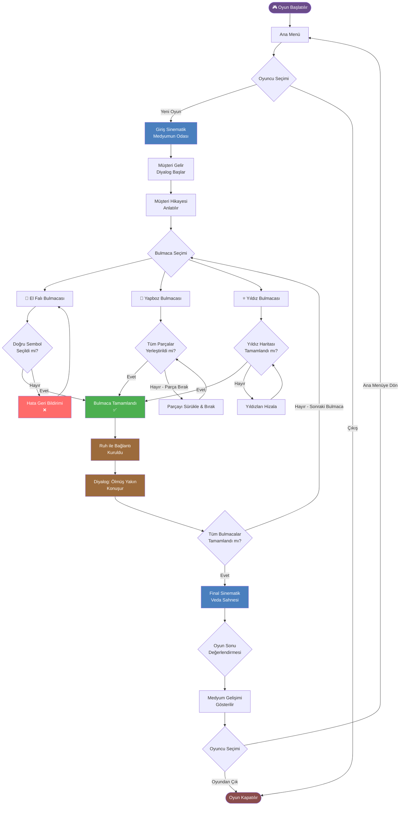

```mermaid
flowchart TD
    A([🎮 Oyun Başlatılır]) --> B[Ana Menü]
    B --> C{Oyuncu Seçimi}
    C --> |Yeni Oyun| D[Giriş Sinematik\nMedyumun Odası]
    C --> |Çıkış| Z([Oyun Kapatılır])

    D --> E[Müşteri Gelir\nDiyalog Başlar]
    E --> F[Müşteri Hikayesi\nAnlatılır]
    F --> G{Bulmaca Seçimi}

    G --> H[🤚 El Falı Bulmacası]
    G --> I[🧩 Yapboz Bulmacası]
    G --> J[⭐ Yıldız Bulmacası]

    H --> H1{Doğru Sembol\nSeçildi mi?}
    H1 --> |Evet| K[Bulmaca Tamamlandı\n✅]
    H1 --> |Hayır| H2[Hata Geri Bildirimi\n❌]
    H2 --> H

    I --> I1{Tüm Parçalar\nYerleştirildi mi?}
    I1 --> |Evet| K
    I1 --> |Hayır - Parça Bırak| I2[Parçayı Sürükle & Bırak]
    I2 --> I1

    J --> J1{Yıldız Haritası\nTamamlandı mı?}
    J1 --> |Evet| K
    J1 --> |Hayır| J2[Yıldızları Hizala]
    J2 --> J1

    K --> L[Ruh ile Bağlantı\nKuruldu]
    L --> M[Diyalog: Ölmüş Yakın\nKonuşur]
    M --> N{Tüm Bulmacalar\nTamamlandı mı?}
    N --> |Hayır - Sonraki Bulmaca| G
    N --> |Evet| O[Final Sinematik\nVeda Sahnesi]

    O --> P{Oyun Sonu\nDeğerlendirmesi}
    P --> Q[Medyum Gelişimi\nGösterilir]
    Q --> R{Oyuncu Seçimi}
    R --> |Ana Menüye Dön| B
    R --> |Oyundan Çık| Z

    style A fill:#6B4C8A,color:#fff
    style Z fill:#8A4C4C,color:#fff
    style K fill:#4CAF50,color:#fff
    style H2 fill:#FF6B6B,color:#fff
    style D fill:#4A7FBE,color:#fff
    style O fill:#4A7FBE,color:#fff
    style L fill:#9C6B3C,color:#fff
    style M fill:#9C6B3C,color:#fff
```
